# Шаблоны проектирования GoF
Код представлен в по ссылке https://github.com/AnnaSpirina/System-architecture-design/tree/main/Lab%20Work%20№6/src
## Порождающие шаблоны (creational)
Порождающие шаблоны — это шаблоны проектирования, которые абстрагируют процесс создания объектов. Они помогают сделать систему независимой от способа создания, композиции и представления объектов. Эти шаблоны дают гибкость в том, какие объекты создавать, как их создавать и как инициализировать.

### Фабричный метод (OrganizationFactory.js)
Фабричный метод — это порождающий шаблон, который определяет интерфейс для создания объекта, но позволяет подклассам изменять тип создаваемых объектов.

**Описание:**
В коде OrganizationFactory является фабрикой, которая создает различные типы студенческих организаций (академические, спортивные, культурные). Вместо прямого вызова конструктора конкретного класса, клиентский код использует фабричный метод createOrganization, передавая тип организации.

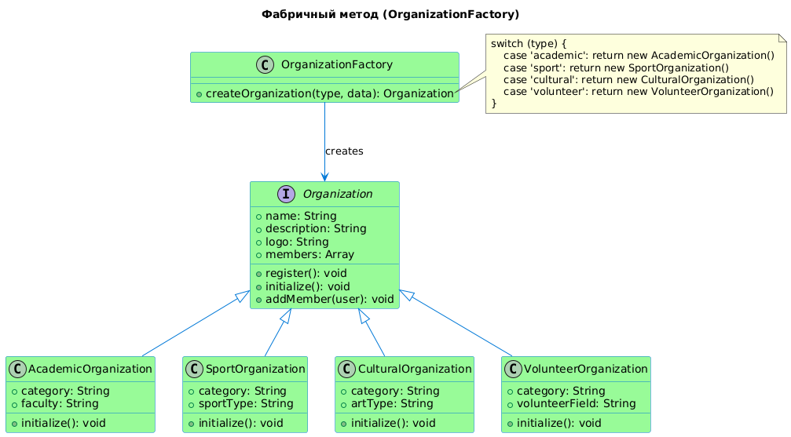

### Абстрактная фабрика (UserFactory.js)
Абстрактная фабрика — это порождающий шаблон, который позволяет создавать семейства связанных объектов, не привязываясь к конкретным классам создаваемых объектов.

**Описание:**
В коде UserFactory является абстрактной фабрикой, которая создает различные типы пользователей (студентов, администраторов, менеджеров, руководителей). Каждый тип пользователя имеет свои особенности и методы, но клиентский код работает с ними через общий интерфейс.

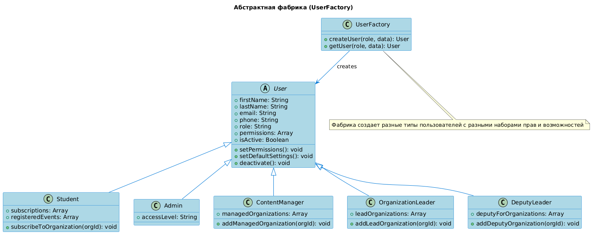

### Одиночка (SingletonDatabase.js)
Одиночка — это порождающий шаблон, который гарантирует, что у класса есть только один экземпляр, и предоставляет глобальную точку доступа к этому экземпляру.

**Описание:**
В коде Database реализован как одиночка, что гарантирует, что во всем приложении будет существовать только один экземпляр базы данных.

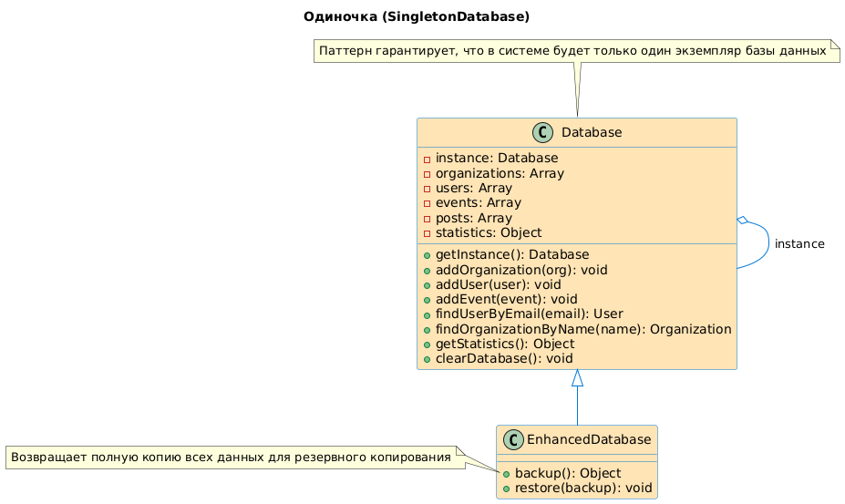

## Структурные шаблоны проектирования (structural)
Структурные шаблоны проектирования отвечают за построение гибких и эффективных иерархий классов. Они показывают, как собирать объекты и классы в более крупные структуры, сохраняя гибкость и эффективность системы.

### Адаптер (OrganizationAdapter.js)
Адаптер — это структурный шаблон, который позволяет объектам с несовместимыми интерфейсами работать вместе.
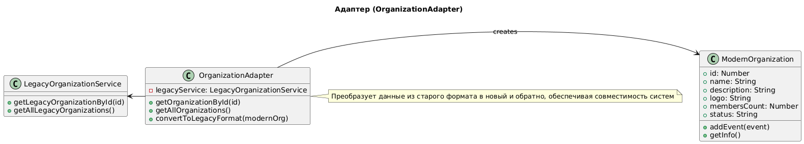

### Компоновщик (CompositeReport.js)
Компоновщик — это структурный шаблон, который позволяет сгруппировать множество объектов в древовидную структуру и работать с ней как с единым объектом.
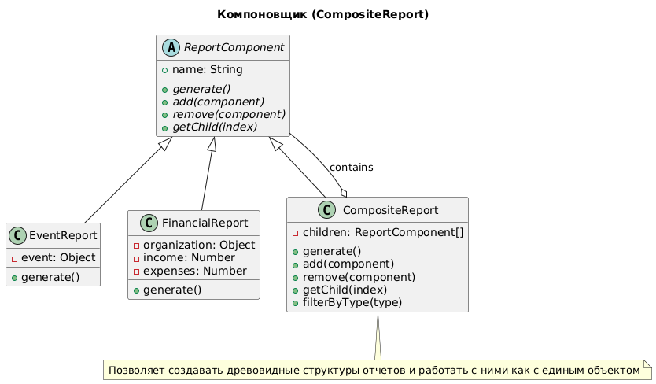

### Декоратор (OrganizationDecorator.js)
Декоратор — это структурный шаблон, который позволяет динамически добавлять объектам новые обязанности.
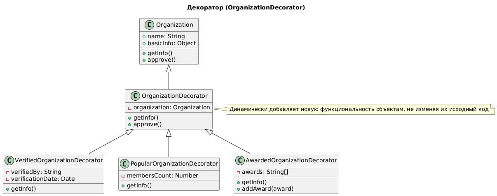

### Заместитель (EventProxy.js)
Заместитель — это структурный шаблон, который предоставляет объект-заместитель, контролирующий доступ к другому объекту.
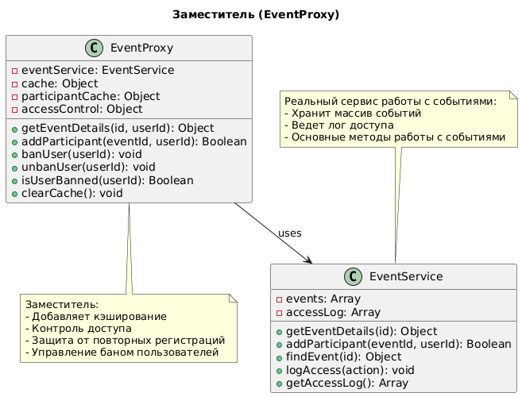

## Поведенческие шаблоны проектирования (behavioral)
Поведенческие шаблоны определяют эффективные способы взаимодействия объектов и распределения ответственности между ними. Они решают задачи:
- Организации взаимодействия между объектами
- Распределения обязанностей между классами
- Упрощения коммуникации между компонентами системы

### Наблюдатель (OrganizationObserver.js)
Наблюдатель - определяет зависимость "один-ко-многим" между объектами, чтобы при изменении состояния одного объекта все зависящие от него объекты автоматически уведомлялись.
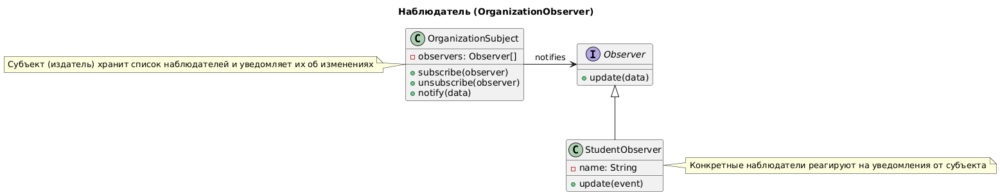

### Команда (EventCommand.js)
Команда - инкапсулирует запрос в виде объекта, позволяя параметризовать клиенты с различными запросами, ставить запросы в очередь или поддерживать отмену операций.
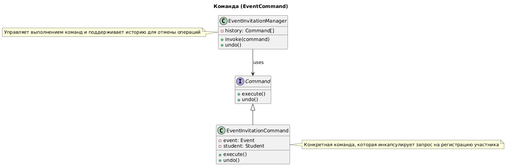

### Стратегия (RoleStrategy.js)
Стратегия - определяет семейство алгоритмов, инкапсулирует каждый из них и делает их взаимозаменяемыми.
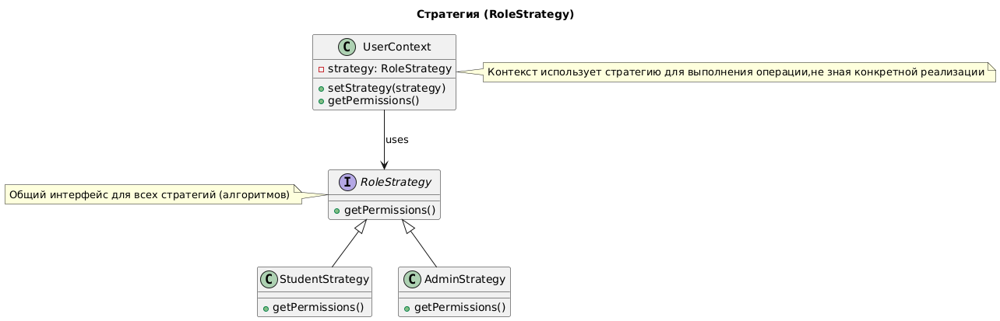

### Итератор (MembershipIterator.js)
Итератор - предоставляет способ последовательного доступа к элементам составного объекта, не раскрывая его внутреннего представления.
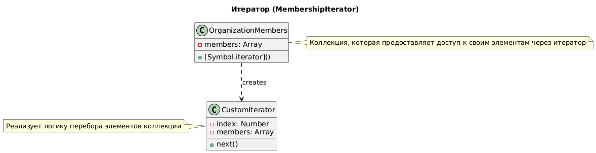

### Состояние (EventState.js)
Состояние - позволяет объекту изменять свое поведение при изменении внутреннего состояния.
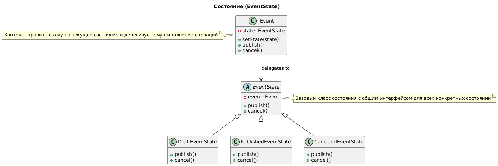

# Шаблоны проектирования GRASP
## Роли (обязанности) класса
### 1. Информационный эксперт (Information Expert)
**Проблема:** Как распределить обязанности между классами?

**Решение:** Назначить ответственность классу, который обладает необходимой информацией

```
class Organization {
  addMember(user) {
    this.members.push(user); // Организация управляет своими участниками
  }
}
```
**Результаты:**
1. Логичное распределение обязанностей
2. Снижение связанности

**Связь:** Используется в паттернах **Команда** и **Наблюдатель**

### 2. Создатель (Creator)
**Проблема:** Кто должен создавать объекты?

**Решение:** Класс B должен создавать экземпляры класса A, если:
- B содержит A
- B агрегирует A

```
class OrganizationFactory {
  createOrganization(type, data) {
    return new Organization(data); // Фабрика создает организации
  }
}
```
**Результаты:**
1. Инкапсуляция логики создания
2. Гибкость при изменении процесса создания

**Связь:** Реализован в **Фабричном методе**

### 3. Контроллер (Controller)
**Проблема:** Кто обрабатывает системные события?

**Решение:** Выделить промежуточный класс между UI и бизнес-логикой

```
class EventInvitationManager {
  invoke(command) {
    this.history.push(command);
    command.execute(); // Контроллер управляет выполнением команд
  }
}
```
**Результаты:**
1. Отделение слоя представления
2. Централизованное управление операциями

**Связь:** Используется в паттерне **Команда**

### 4. Чистая выдумка (Pure Fabrication)
**Проблема:** Как обрабатывать сложные операции, не нарушая принцип Информационного эксперта?

**Решение:** Создать искусственный класс, который не представляет предметную область

```
class ReportGenerator {
  generateAnnualReport(organizations) {
    // Собирает данные из разных источников
    return {
      totalEvents: organizations.reduce((sum, org) => sum + org.events.length, 0),
      totalMembers: organizations.reduce((sum, org) => sum + org.members.length, 0)
    };
  }
}
```
**Результаты:**
1. Сохранение слабой связанности
2. Централизация сложной логики

**Связь:** Используется в Компоновщике (CompositeReport)

### 5. Посредник (Indirection)
**Проблема:** Как уменьшить прямую связь между компонентами?

**Решение:**  Ввести промежуточный объект-посредник

```
class NotificationService {
  constructor() {
    this.channels = [];
  }

  addChannel(channel) {
    this.channels.push(channel);
  }

  send(message) {
    this.channels.forEach(channel => channel.notify(message));
  }
}
```
**Результаты:**
1. Устранение прямых зависимостей
2. Гибкость в изменении способов уведомления

**Связь:** Реализован в Наблюдателе (Observer)

## Принципы разработки

### 1. Polymorphism (Полиморфизм)
**Проблема:** Как обрабатывать разные типы объектов единообразно, не используя условные операторы?

**Решение:**  Использовать полиморфизм для замены условий на динамическое поведение объектов.

```
class User {
  getPermissions() {
    throw new Error("Method not implemented");
  }
}

class Student extends User {
  getPermissions() {
    return ['view_events', 'register'];
  }
}

class Admin extends User {
  getPermissions() {
    return ['manage_users', 'edit_content'];
  }
}

// Использование:
function checkAccess(user) {
  const permissions = user.getPermissions(); // Полиморфный вызов
  return permissions.includes('manage_users');
}
```
**Результаты:**
1. Устранение switch/if-else для типов
2. Легкое добавление новых вариантов поведения

**Связь:**
- Стратегия (разные алгоритмы через общий интерфейс)
- Команда (единый метод execute() для всех команд)

### 2. Low Coupling (Низкая связанность)
**Проблема:** Как минимизировать зависимости между классами?

**Решение:**  Снижать количество связей и делать оставшиеся — слабыми (через интерфейсы).

```
// Плохо: жёсткая связь
class EventService {
  constructor() {
    this.emailSender = new EmailService(); // Прямая зависимость
  }
}

// Хорошо: слабая связь через интерфейс
class EventService {
  constructor(notificationService) { // Принимает абстракцию
    this.notificationService = notificationService;
  }
}
```
**Результаты:**
1. Классы легче тестировать изолированно
2. Проще заменять реализации
3. Уменьшается "эффект домино" при изменениях

**Связь:**
- Адаптер (изолирует внешние системы)
- Наблюдатель (связь через события, а не прямые вызовы)

### 3. High Cohesion (Высокая связность)
**Проблема:** Как избежать God Object, делающих слишком много?

**Решение:** Распределять функциональность так, чтобы классы решали одну задачу.

```
// Низкая связность (плохо):
class UserManager {
  createUser() { /* ... */ }
  sendEmail() { /* ... */ }
  generateReport() { /* ... */ }
}

// Высокая связность (хорошо):
class UserRepository {
  save(user) { /* Только сохранение */ }
}

class EmailService {
  send(to, message) { /* Только отправка */ }
}

class ReportGenerator {
  generate(user) { /* Только отчёты */ }
}
```
**Результаты:**
1. Классы проще понимать и поддерживать
2. Изменения в одной области не затрагивают другие
3. Упрощается повторное использование кода

**Связь:**
- Команда (каждая команда инкапсулирует одно действие)
- Декоратор (добавляет малые фрагменты поведения)

## Protected Variations (Защита от изменений)
**Свойство программы:** Устойчивость к изменениям в volatile-частях системы.

**Проблема:** Прямая зависимость от конкретного сервиса уведомлений (например, Email). При изменении API или добавлении новых каналов (SMS, Telegram) придётся переписывать код мероприятий.

**Решение:** Создать стабильный интерфейс для уведомлений, изолирующий изменения.

```
// Стабильный интерфейс:
class INotificationService {
  send(user, message) {
    throw new Error("Method not implemented");
  }
}

// Реализации для изменчивых частей:
class EmailNotificationService extends INotificationService {
  send(user, message) {
    console.log(`[Email] Отправлено ${user.email}: "${message}"`);
    // Реальная логика через SMTP/API
  }
}

class TelegramNotificationService extends INotificationService {
  send(user, message) {
    console.log(`[Telegram] Отправлено @${user.telegram}: "${message}"`);
    // Вызов Telegram Bot API
  }
}

// Использование в коде мероприятий
class Event {
  constructor(notificationService) { // Принимает абстракцию
    this.notificationService = notificationService;
    this.participants = [];
  }

  addParticipant(user) {
    this.participants.push(user);
    this.notificationService.send(
      user,
      `Вы зарегистрированы на мероприятие "${this.name}"`
    );
  }
}

// Инициализация (защищённая от изменений)
// Имплементацию можно менять без правок Event:
const emailNotifier = new EmailNotificationService();
const event = new Event(emailNotifier);

// Или переключить на Telegram без изменений в Event:
const telegramNotifier = new TelegramNotificationService();
const event = new Event(telegramNotifier);
```

**Результаты**
1. Гибкость: Добавление нового канала (SMS, VK) требует только нового класса, но не изменений в Event.
2. Тестируемость: Можно подменить notificationService на заглушку (Mock).
3. Соответствие Open/Closed Principle: Код открыт для расширений, но закрыт для изменений.

**Связь:**
- Адаптер: Если новый сервис уведомлений имеет сложный API, можно добавить адаптер.
- Стратегия: Выбор канала уведомлений можно менять динамически.
